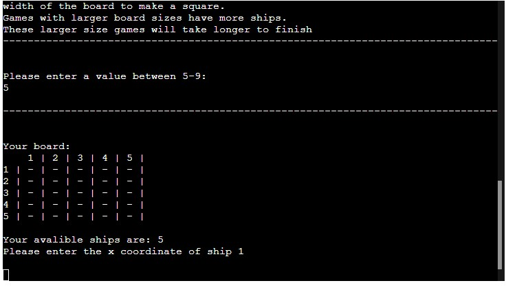

# Battleships: Top Secret Training Simulator
Battleships: Top Secret Training Simulator is a classic battleship game experience which runs through the Code Institute mock terminal on Heroku.
Users can win by hitting all of the computer ships before the computer hits theirs.

Each battleship is one square/location on the boards, and the number of ships are either 5 or 9, depening on the board size. 

Board sizes between 5-7 have 5 ships, and larger boards have 9 with the maximum board size being 9.

## How to play
Players chose a board size, 5-9, which is then used as the X and Y values of a grid/board, and to determine the number of ships placed on the board.

Players then place each ship by X and Y coordinates on their board which are marked with a # symbol.

After the placements, the player guesses the X and Y coordinates on the enemy board, with the computer randomly generating theirs.

Each board is updated with a X or O for hit and miss respectively.

This occours each round until one board's ships are all hit and then the player isformed of a win/loss/draw.

The option to play again or exit the game is then given to the player.

## Features

### Existing Features

- Selecting board size
  - Players are given the option to chose their board size
  - This ranges from 5-9 as shown below
  - Board size of 5:
  
  - Board size of 9 (maximum):
  

- User chooses ship placement
  - The user can place their ships in at the coordinates they chose
  
- Play against the computer
- Accepts user input
- Input validation, error-checking and exception handling
  - You cannot enter coordinates outside the grid
  - You must enter numbers
  - You cannot enter the same coordinates twice
  
  - Data maintained in class instances

### Future Features
- Ship sizes larger than 1x1 (e.g. 2,3,3,4 & 5 on one board)

## Data Model
I used a Board class as my data model as it allowed for ease of replication of a Board to be used for the player and computer.

The class stores the number os ships, size, print board, ship locations and the board 2d array.

The class also has methods to construct the board, printable board string, to update the board, to check for ship, to manually and randomly place ships, and to check if a board location is used/empty.

## Testing
I have manually tested this project using the follwing methods:
- PEP8 linter which returned no problems.
- I gave invalid inputs: strings when numbers are expected, out of bounds inputs and the same inputs twice.
- Testing occoured in the local terminal and in the deployed heroku mock terminal from the Code Institute.

### Bugs
#### Solved Bugs
- Due to inputs beggining at 1, a few of the class methods did not work when using the input to index arrays.
  - To solve this I ensured all inputs were -=1 before passing to the indexing method.
- The string builder did not properly return the printable board string.
  - This was due to the for loop not looping the correct amount to build each row.
#### Remaining Bugs
- There are no remaining bugs
### Validator Testing
- PEP8
  - No issues were found
  

  ## Deployment
  This project was deployed using Code Institute's mock terminal for Heroku.
  - Steps for deployment
    - Fork or clone this repository
    - Create a new Heroku app
    - Set the buildpacks to Python and NodeJS in that order.
    - Link the Heroku app to the repository
      - I did this from my local terminal using git push heroku main as their was an issue with Heroku/Github linking at that time
    - Click 'Deploy'
## Credits
- Code Institue for the deployment terminal.